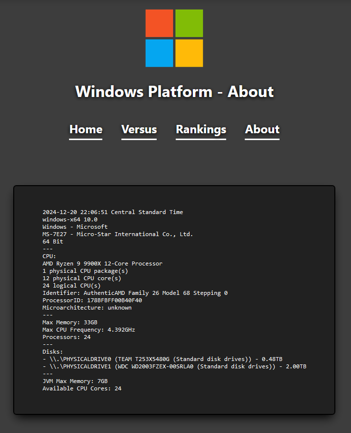

# ⌚ benchmarks

> Programming benchmarks

[](https://github.com/gmitch215/benchmarks)
[](https://github.com/gmitch215/benchmarks)
[](https://github.com/gmitch215/benchmarks/discussions)
[](https://github.com/gmitch215/benchmarks)

This repository contains various benchmarks on different programming languages for different algorithms. The primary goal of this repository is to provide a comparison between different programming languages and their speeds.

You can navigate to the website [here](https://benchmarks.gmitch215.xyz), or by clicking the linked website on the repository.

## Local Benchmarking

This repository also features the ability to benchmark all the algorithms locally.

### Running Specific Benchmarks

Benchmarks offers two gradle tasks: `compileBenchmark` and `runBenchmark`, to run specific benchmarks.

```bash
./gradlew compileBenchmark runBenchmark -Planguage={language} -Pfile={file}
```

For example, to run `count-1M` for `c` using Clang, you would run:

```bash
./gradlew compileBenchmark runBenchmark -Planguage=c-llvm -Pfile=count-1M/main.c
```

> [!NOTE]
> `compileBenchmark` is only required to be passed for compiled languages. Gradle will automatically skip interpreted languages passed,
> like `python` and `ruby`.

```bash
./gradlew runBenchmark -Planguage=ruby -Pfile=count-1M/main.rb
```

#### `compileBenchmark`

Any language with a `compile` command in the [`config.yml`](./benchmarks/config.yml) file needs to be compiled first before it can run with the `run` commmand.

To compile the code, you can run the `compileBenchmark` task in the root directory for the repository:

```bash
./gradlew compileBenchmark -Planguage={language} -Pfile={file}
```

The task accepts two parameters:

`language` - ID of the language in the [`config.yml`](./benchmarks/config.yml) file

`file` - File to compile relative to the `benchmarks` directory

For example, to compile the HTTP GET benchmark for Kotlin/Native, you would run:

```bash
./gradlew compileBenchmark -Planguage=kotlin-native -Pfile=http-get/main.kt
```

#### `runBenchmark`

After compiling the benchmarks, you can run them using the `runBenchmark` task:

```bash
./gradlew runBenchmark -Planguage={language} -Pfile={file}
```

The task accepts the same parameters as the `compileBenchmark` task.

For example, to run the HTTP GET benchmark for Kotlin/Native, you do:

```bash
./gradlew compileBenchmark runBenchmark -Planguage=kotlin-native -Pfile=http-get/main.kt
```

http-get` measures in `ms` according to its benchmark [`config.yml`](./benchmarks/http-get/config.yml), so the output will be in milliseconds.

### Running All Benchmarks

#### Prerequisites

**All** command line tools present in [`config.yml`](./benchmarks/config.yml) must be installed. You can determine if you meet them by running
the `version`, `compile`, and/or `run` commands in the terminal.

Here are some notable examples:

- `java` for Java (*Requires Java 21 or higher*)
- `kotlinc` for Kotlin JVM
  - This requires the `KOTLIN_HOME` environment variable to be set to the Kotlin compiler directory (**not** the bin directory).
- `kotlinc-native` for Kotlin Native
  - This requires the `KOTLIN_NATIVE_HOME` environment variable to be set to the Kotlin Native compiler directory (**not** the bin directory).
- `ruby` for Ruby
- `python` for Python
- `gcc`/`g++` **and** `clang`/`clang++` for C/C++
- `rustc` for Rust
- `go` for Go
- `node`, `deno` **and** `bun` for JavaScript

You can test if you have the necessary tools and setup by running the `validate` gradle task:

```bash
./gradlew validate
```

#### IntelliJ IDEA

The repository comes with two IntelliJ IDEA run configuration that allows you to run benchmarks directly from the IDE:

- `benchmark` - Runs and graphs the benchmarks
- `all` - Runs and graphs the benchmarks, then prepares and serves the website

#### CLI

To both run and graph the benchmarks, you can use the following command:

```bash
./gradlew benchmark
```

Benchmarks will be generated in JSON format in the `benchmarks/output` directory.

Interactive HTML graphs are available in the `benchmarks/output/graphs` directory.

After that, you can prepare and serve the website by running:

```bash
./gradlew preview
```

You can navigate to the website by visiting `http://localhost:4000`.

The preview output only creates benchmarks for your hosting operating system. 
For example, if you're benchmarking your computer on a Windows machine, clicking on `macOS` or `Linux` will report a 404 error.
Otherwise, you can navigate through the website as if it were live.



## Contributing

Contributors are always welcome.

If you would like to contribute to this repository, please read the [CONTRIBUTING.md](./CONTRIBUTING.md) file.

## License

This repository is licensed under the [Apache License 2.0](./LICENSE).

As per outlined in the license, you are free to use, modify, distribute, and sublicense this repository for personal or commercial use.
However, you must include the **original copyright** and **license** in any copy of the software.

By using the software, locally or on its [website](https://benchmarks.gmitch215.xyz), you agree to the terms and conditions outlined in the license.